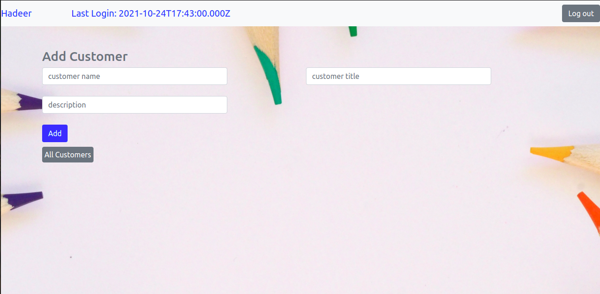

# Customer-Portal

## TO Run
you should install all packeges in "package.json" file and run command "nodemon index.js"

### I used Nodejs and for views I used EJS with Mysql database. 
- Registeration 

- Login

- Add Customers

- List Customers

- view one customer

